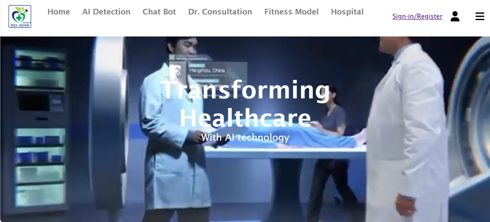

# Sehat Sahayak

This project focuses on the having an integrated platform for different diseases prediction like brain tumour,chest-Xray, Heart Diseases, Healthy and non healthy food,Mental health fitness,Diabetes prediction.

1. Brain Tumour Prediction:
Developed a machine learning model that analyzes brain scans (MRI or CT scans) to predict the likelihood of a brain tumor.
Utilized image processing and deep learning techniques to identify patterns and anomalies indicative of brain tumors.

2. Chest X-ray Analysis:
Implemented a model for analyzing chest X-rays to detect respiratory conditions, such as pneumonia or tuberculosis.
Utilized convolutional neural networks (CNNs) or other image recognition techniques to identify abnormalities in chest X-ray images.

3. Heart Disease Prediction:
Developed a predictive model for assessing the risk of heart diseases.
Consider factors like blood pressure, cholesterol levels, age, and other relevant health indicators.
Machine learning algorithms, such as logistic regression or decision trees, are employed for this prediction.

4. Healthy and Non-Healthy Food:
Created a nutrition analysis system that helps users make informed decisions about their diet.
Implemented a food classification model to categorize food items as healthy or unhealthy based on nutritional content.
Considered integrating a database of nutritional information to enhance accuracy.

5. Mental Health Fitness:
Developed a mental health assessment tool that evaluates psychological well-being.
Utilized surveys, questionnaires,  analyze text input including sleep diorderness and cycle of mental health issues.
Considered incorporating mood tracking and other relevant features.

6. Diabetes Prediction:
Created a model to predict the risk of diabetes based on factors such as blood sugar levels, BMI, family history, etc.
Machine learning algorithms like KNN,decision trees are applied to predict diabetes onset.

