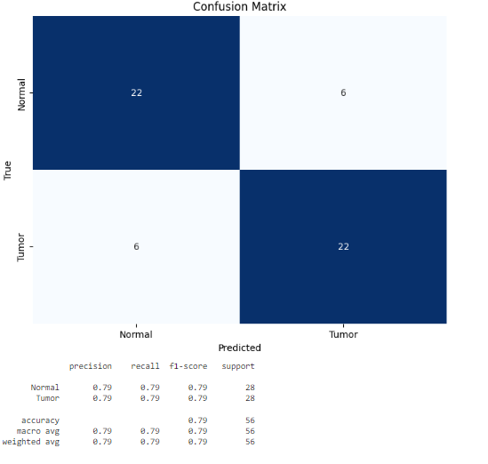
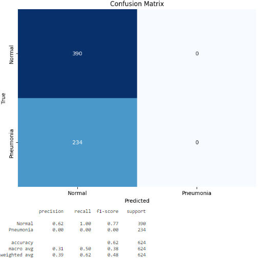
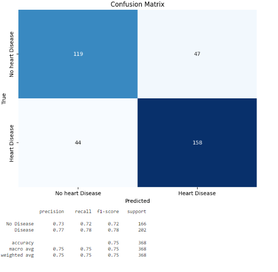
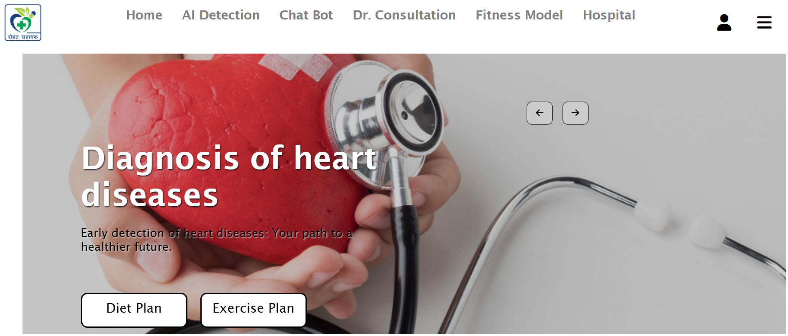
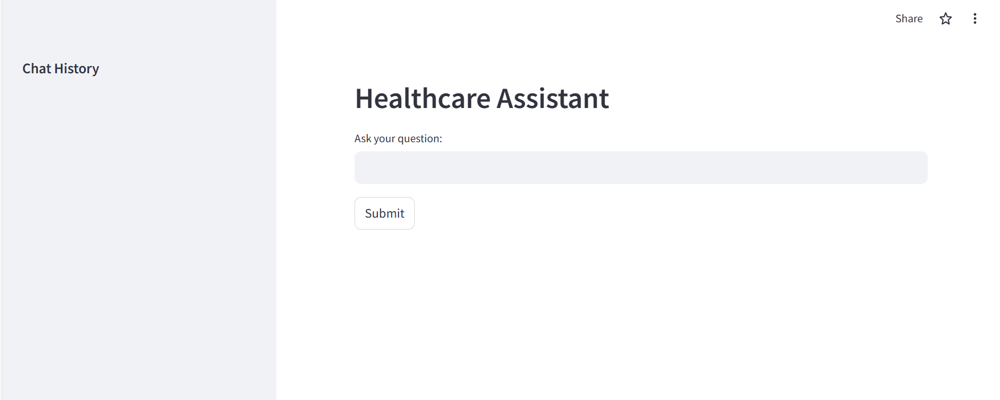

# Sehat Sahayak

This project focuses on the having an integrated platform for different diseases prediction like brain tumour,chest-Xray, Heart Diseases, Healthy and non healthy food,Mental health fitness,Diabetes prediction.

To visit the website please click below:

# 1. Brain Tumour Prediction:
Developed a machine learning model that analyzes brain scans (MRI or CT scans) to predict the likelihood of a brain tumor.
Utilized image processing and deep learning techniques to identify patterns and anomalies indicative of brain tumors.For this I have used CNN to classify the images into brain tumor and non brain tumor characteristics.

## Machine learning model used:CNN 
## Accuracy:79% 

# 2. Chest X-ray Analysis:
Implemented a model for analyzing chest X-rays to detect respiratory conditions, such as pneumonia or tuberculosis.
Utilized convolutional neural networks (CNNs) or other image recognition techniques to identify abnormalities in chest X-ray images.

## Machine learning model used:CNN 
## Accuracy: 62%

# 3. Heart Disease Prediction:
Developed a predictive model for assessing the risk of heart diseases.
Consider factors like blood pressure, cholesterol levels, age, and other relevant health indicators.
Machine learning algorithms, such as logistic regression or decision trees, are employed for this prediction.

## Machine learning model used:KNN
## Accuracy: 75%

# 4. Healthy and Non-Healthy Food:
Created a nutrition system that helps users make informed decisions about their diet.It is a fitness model which consist of diet plan and exercise plan.The user can take benefit of it to maintain their fitness.

# 5. Diabetes Prediction:
Created a model to predict the risk of diabetes based on factors such as blood sugar levels, BMI, family history, etc.
Machine learning algorithms like KNN,decision trees are applied to predict diabetes onset.

## Machine learning model used:Random Forest Classifiers
## Accuracy: 92%

# 6. AI CHAT BOT: 
An Ai chat bot it integrated with the website which will guide the users with different diseases and give them best advices.This chat bot is made using streamlit and Gemini API.

# 7. Hospital and doctor facitlites:
Provided the users with hospitals and doctors facilities according to the location and disease.

